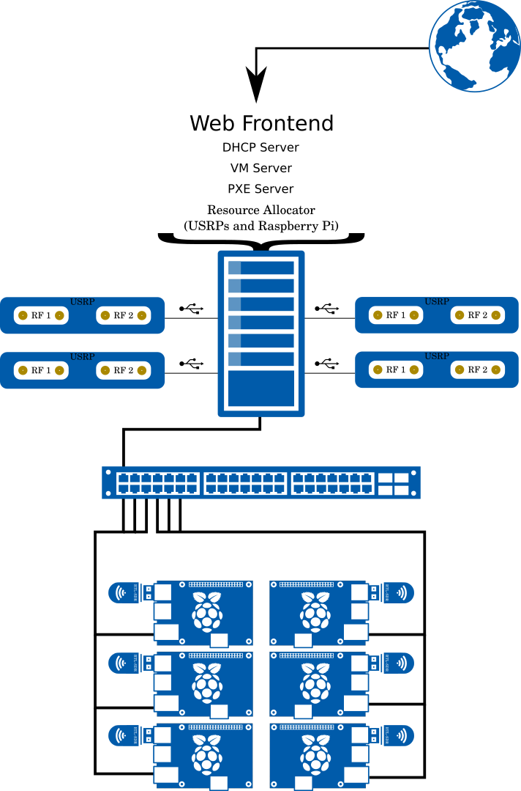
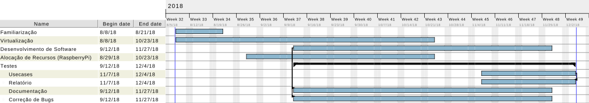

# The Raspberry Pi SDR Testbed

This project aims to develop an SDR Testbed based on RTL-SDR dongles plugged into RaspberryPi3 hardware.
Also, we will have USRPs connected to Virtual machines to act as more powerfull transmitters.

The resources will be made available from a web interface which will give the user access to the hardware via SSH console.
With this, the user will be able to access softwares that interface with the SDR to conduct experiments using our harware.

# Architecture

The project's architecture is defined below:



# Code structure

```
pi_testbed
|
+--docs
|
+--code
|  |
|  +--resourcemanager
|  +--scripts
|  +--webserver
```

# Project Gantt Chart

The project's Gantt Chart defined below:



This chart represents the defined timeline for the project.

# Installation instructions

## Server
This installation was tested only in an Arch Linux Distribution.
The server needs to have 2 Ethernet interfaces: one to connect to the internet and another to create an internal network for the Raspberry Pis and Virtual Machines.

### Basic installation
Here we will install all necessary packages for the server.

```
sudo pacman -S libuhd python2 qemu libvirt ebtables dnsmasq bridge-utils virt-manager dmidecode python-pip
```

Also we need to create a user so the experiments can access the private network, so:
```
sudo useradd hop
sudo passwd hop #to set the password. Use "aicthop"
```

### USRPs
The USRP drivers are required so the server can detect connected USRPs and make them available to use on the platform.

```bash
sudo uhd_images_downloader
sudo uhd_find_devices
```

### Virtualization
For the virtualization, we need to configure group permissions and start virtualization services.

```bash
sudo usermod -aG libvirt $USER

sudo su
echo '

#################################################################
#
# Network connectivity controls
#
listen_tls = 0
listen_tcp = 1
listen_addr = "0.0.0.0"

#################################################################
#
# UNIX socket access controls
#
unix_sock_group = "libvirt"
unix_sock_ro_perms = "0777"
unix_sock_rw_perms = "0770"

#################################################################
#
# Authentication.
#
auth_unix_ro = "none"
auth_unix_rw = "none"
' >> /etc/libvirt/libvirtd.conf
exit

sudo systemctl enable libvirtd
sudo systemctl start libvirtd
```

### DHCP Server
#### Creating a bridge device
The bridge device will be the main connection between all virtual machines and Raspberry Pis. It will allow experimenters to interact with the allocated resources.

```bash
sudo su
echo "Description='Example Bridge connection'
Interface=br0
Connection=bridge
BindsToInterfaces=(enp2s0)
IP=static
Address='10.0.0.1/24'
SkipForwardingDelay=yes
" >> /etc/netctl/br0
exit

sudo netctl enable br0
sudo netctl start br0
```

#### Setting up iptables for internet forwarding
So the resources have internet available, we need to enable NAT translation and forward packages from the internet to the internal network and vice versa.

```
sudo su
echo "net.ipv4.ip_forward=1
net.ipv6.conf.default.forwarding=1
net.ipv6.conf.all.forwarding=1" > /etc/sysctl.d/30-ipforward.conf
exit

sudo iptables -t nat -A POSTROUTING -o eno1 -j MASQUERADE
sudo iptables -A FORWARD -m conntrack --ctstate RELATED,ESTABLISHED -j ACCEPT
sudo iptables -A FORWARD -i br0 -o eno1 -j ACCEPT
```

#### Setting up dnsmasq
Finally we setup a DHCP server using `dnsmasq`.

```
sudo su
echo 'interface=br0
bind-interfaces
domain=pitestbed.gtel.ufc.br
dhcp-option=3,10.0.0.1 # Gateway
dhcp-option=6,8.8.8.8 # DNS
dhcp-range=10.0.0.100,10.0.0.150,12h
' >> /etc/dnsmasq.conf
exit

```

### Web Interface
The web interface needs to be cloned and its requirements need to be installed.

```
sudo pacman -S python-pip
git clone https://github.com/jpinheiro228/pi_testbed.git
cd pi_testbed
sudo pip install -r requirements.txt
```

## Virtual Machine Base Image
Create a virtual machine with name "default". HINT: to speedup the process, you might want to create this virtual machine with maximum resources, specially because this one is not supposed to be used. With that, compilation tasks will run very fast.

The following commands are to install the latest USRP drivers and the GNU Radio 7.7.13.4, which was tested for usage with this platform.

```
sudo add-apt-repository ppa:ettusresearch/uhd

sudo apt update
sudo apt dist-upgrade -y
sudo apt install qemu-guest-agent
#install Xorg
sudo apt-get -y install xorg openbox

# Install gnuradio
sudo apt-get -y install git cmake g++ python-dev swig libvolk1-dev \
pkg-config libfftw3-dev libboost-all-dev libcppunit-dev libgsl-dev \
libusb-dev libsdl1.2-dev python-wxgtk3.0 python-numpy python-cheetah \
python-lxml doxygen libxi-dev python-sip libqt4-opengl-dev libqwt-dev \
libfontconfig1-dev libxrender-dev python-sip python-sip-dev python-qt4 \
python-sphinx libusb-1.0-0-dev libcomedi-dev libzmq3-dev python-mako \
python-gtk2-dev libuhd-dev uhd-host libvolk1-bin libuhd003.010.003

sudo uhd_images_downloader

volk_profile

git clone --recursive http://gnuradio.org/git/gnuradio.git

cd gnuradio
git checkout v3.7.13.4
mkdir build
cd build
cmake ../
make -j4
sudo make install

export PYTHONPATH=$PYTHONPATH:/usr/local/lib/python2.7/dist-packages
export LD_LIBRARY_PATH=$LD_LIBRARY_PATH:/usr/local/lib

sudo ldconfig

sudo addgroup usrp
sudo usermod -aG usrp ubuntu
echo 'ACTION=="add", BUS=="usb", SYSFS{idVendor}=="fffe",
SYSFS{idProduct}=="0002", GROUP:="usrp", MODE:="0660"' > tmpfile
sudo chown root:root tmpfile
sudo mv tmpfile /etc/udev/rules.d/10-usrp.rules

sudo /etc/init.d/udev stop
sudo /etc/init.d/udev start
```
Also, change the interface name on `/etc/netplan/50-cloud-init.yaml` to `ens3`

Finally, we need to reset the VM on the first run, so the DHCP settings are correctly configured.
For that, we create a `/etc/rc.local` with the following contents:

```
#!/usr/bin/env bash

rm /home/ubuntu/.bash_history

rm /etc/machine-id

/bin/systemd-machine-id-setup

/bin/rm -v /etc/ssh/ssh_host_*

dpkg-reconfigure openssh-server

/sbin/reboot
```

This file needs to be executable. So `sudo chmod +x /etc/rc.local`.

This will reset all important settings on the VM and leave it ready for use.
Note that this needs to be done every time the default image is changed.

## Raspberry Pi

## Starting the server
```
sudo uhd_find_devices
cd pi_testbed/code/webserver
python3 server.py
```
